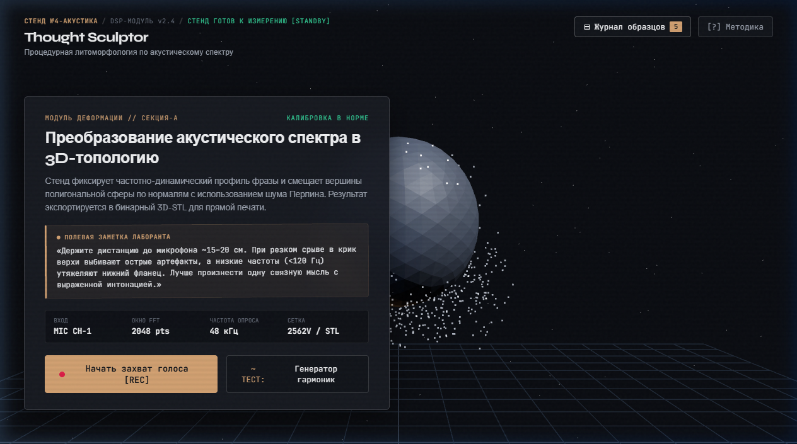
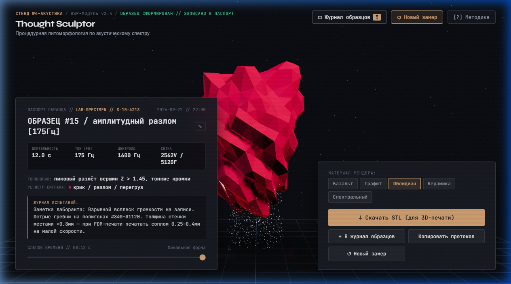
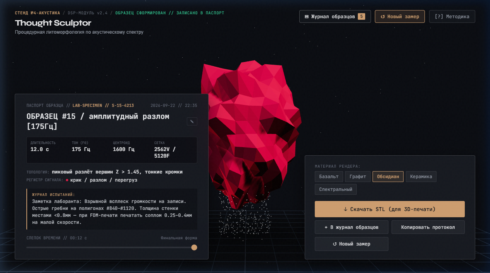
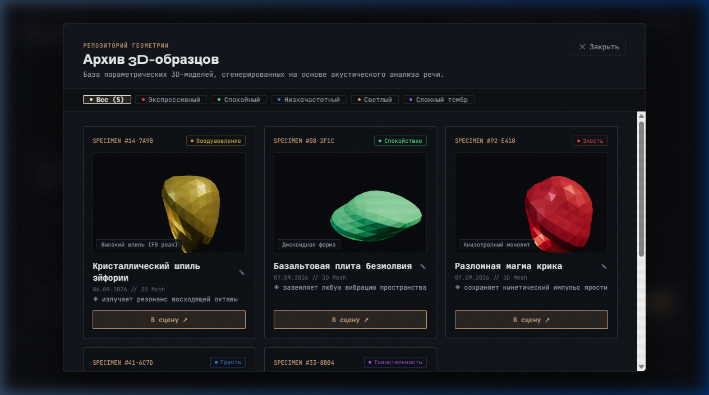

# Thought Sculptor

Интерактивное веб-приложение на React, Three.js и Web Audio API, преобразующее голос человека в уникальные трехмерные каменные артефакты в реальном времени.

Акустические параметры речи (высота тона, динамика, форманты, спектральный центроид и шумность дыхания) влияют на процедурную деформацию полигональной сетки, запекая интонацию в твердую породу.

---

## Скриншоты

### 1. Исходное состояние (Дремотный монолит)


### 2. Процесс записи и динамическая акустическая деформация


### 3. Кристаллизованный артефакт и панель параметров


### 4. Зал слепков (Галерея образцов с аудиозаписями)


---

## Архитектура и возможности

### 1. Анализ акустики в реальном времени (Web Audio API)
- Расчет RMS-энергии и фильтрация шума окружения.
- Детекция основного тона (F0) методом автокорреляции во временной области.
- Спектральный анализ: расчет спектрального центроида (яркость тембра), плоскостности спектра (flatness / шумность дыхания) и спектрального потока (spectral flux).
- Классификация эмоционально-тембрального профиля (злость/перегруз, меланхолия, воодушевление, таинственность, спокойствие).

### 2. Процедурная геометрия (Three.js)
- Исходная форма: икосаэдр с высокой плотностью полигонов и сглаженными нормалями.
- Деформация сетки в реальном времени: радиальные гармонические смещения вдоль нормалей, вертикальный конус (taper), винтовое скручивание (twist) и изгиб оси.
- PBR-материалы: базальт, обсидиан, графит и керамика с процедурными картами шероховатости и рельефа, генерируемыми на лету.
- Динамическое освещение, частицы распада и контактные тени.

### 3. Интерактивный таймлайн и экспорт
- Запись снапшотов деформации каждую секунду с возможностью покадрового скраббинга изменений формы.
- Экспорт кристаллизованной трехмерной геометрии в бинарный/текстовый формат STL для прямой 3D-печати.
- Запись голоса в формате WebM Opus с возможностью воспроизведения в карточке артефакта.
- Локальная галерея (Зал слепков) в localStorage с сохранением авторских подписей и метаданных.
- Синтетический голосовой генератор для демонстрации возможностей без подключения микрофона.

---

## Стек технологий

- React 19
- TypeScript
- Three.js
- Vite
- Web Audio API / MediaRecorder API
- Lucide React

---

## Установка и запуск

### Требования
- Node.js 18+
- npm / pnpm / yarn

### Запуск в режиме разработки
```bash
npm install
npm run dev
```
Приложение будет доступно по адресу `http://localhost:5173`.

### Сборка проекта
```bash
npm run build
```
Готовая статическая сборка будет сгенерирована в директории `dist/`.

### Проверка линтером
```bash
npm run lint
```
